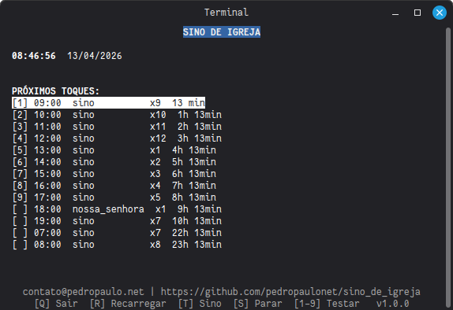
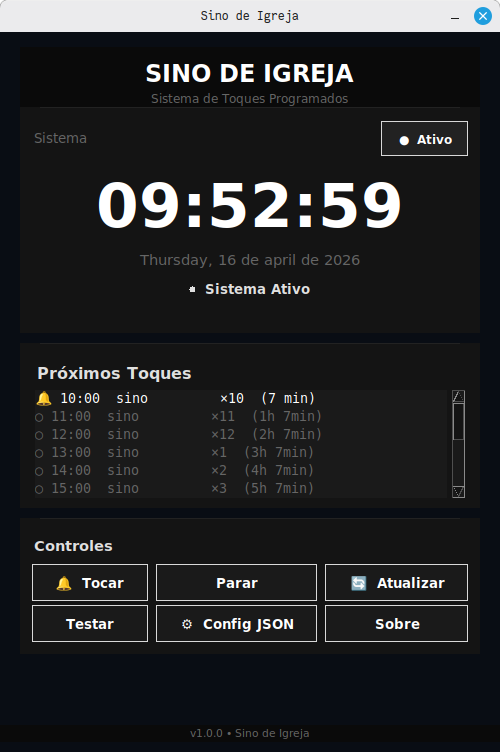

Sino de Igreja
==============

Programa simples em Python para tocar sinos em horários programados (Linux / Raspberry Pi).

Interface Terminal (curses):


Interface Gráfica (Tkinter):


Principais pontos
- Duas interfaces: curses (terminal) ou Tkinter (gráfica).
- Configuração em `config.json` (chaves: `sons`, `programacao`, `hora`, `minuto`, `som`, `repeticoes`).
- Reproduz áudio via `pygame` (preferido) ou fallback para `ffplay`, `paplay`, `aplay` ou `omxplayer`.
- Tecla `S` interrompe o toque em andamento (implementação segura que termina apenas os processos iniciados pelo programa).

Instalação
---------

1. Instale dependências (recomendado em venv):

```
pip install -r requirements.txt
```

2. Opcional: instale `ffmpeg`/`pulseaudio`/`omxplayer` se não for usar `pygame`.

Executando
---------

- Interface gráfica (Tkinter) - modo janela:
```
./sino_igreja_gui.sh
```
ou
```
python3 sino_igreja_gui.py
```

- Interface terminal (curses) - modo gráfico no terminal:
```
./sino_igreja.sh
```
ou
```
python3 sino_igreja.py
```

- Modo console (sem interface):
```
python3 sino_igreja.py --console
```

Controles principais (Interface Terminal / curses)
- Q: sair
- R: recarregar `config.json`
- T: tocar o som principal (1x)
- S: parar o som/loop em execução
- Espaço: tocar o som principal 3x
- 1-9: tocar um dos próximos toques listados

Controles principais (Interface Gráfica / Tkinter)
- Botões na tela: Tocar, Parar, Atualizar, Testar, Config JSON, Sobre

Configuração
-----------

Exemplo `config.json`:

```
{
  "sons": {
    "sino": "sounds/sino.mp3",
    "nossa_senhora": "sounds/nossa_senhora.mp3"
  },
  "programacao": [
    {"hora": 7, "minuto": 0, "som": "sino", "repeticoes": 7},
    {"hora": 19, "minuto": 0, "som": "nossa_senhora", "repeticoes": 1}
  ]
}
```

Verificações / Debug
- Verificar saída do programa para mensagens de erro sobre áudio ou configuração.
- Para testar `stop()` com players externos, execute um toque longo e pressione `S`, depois confira processos com `ps aux | grep ffplay` (ou equivalente).
- Ver versão e informações: `python3 sino_igreja.py --sobre`

Autostart com systemd (Raspberry Pi / Linux)
---------------------------------------------

O programa pode iniciar automaticamente como serviço do systemd.

1. Copie o arquivo de unit para o diretório do systemd:

```
sudo cp systemd/sino_igreja.service /etc/systemd/system/sino_igreja.service
```

2. Edite o arquivo copiado e ajuste os caminhos conforme seu ambiente:

```
sudo nano /etc/systemd/system/sino_igreja.service
```

Modifique estas linhas:

- `WorkingDirectory=/home/pi/sino.bash` — caminho onde o projeto está
- `ExecStart=/usr/bin/python3 /home/pi/sino.bash/sino_igreja.py --console` — caminho do python3 e do script
- `User=pi` — usuário que vai rodar o serviço (precisa ter acesso ao áudio)

3. Recarregue e ative o serviço:

```
sudo systemctl daemon-reload
sudo systemctl enable --now sino_igreja.service
```

4. Verifique o status:

```
sudo systemctl status sino_igreja.service
```

5. Ver os logs:

```
sudo journalctl -u sino_igreja.service -f
```

Notas:
- O serviço inicia em modo console (sem interface curses).
- Se usar `omxplayer` ou `aplay`, certifique-se de que o usuário do serviço está no grupo `audio`: `sudo usermod -aG audio pi`
- Para parar: `sudo systemctl stop sino_igreja.service`
- Para desabilitar: `sudo systemctl disable sino_igreja.service`

Arquivos importantes
- `sino_igreja.py` - código principal (interface terminal/curses)
- `sino_igreja_gui.py` - interface gráfica (Tkinter)
- `config.json` - horários e sons
- `sino_igreja.sh` - lançador para interface terminal
- `sino_igreja_gui.sh` - lançador para interface gráfica
- `systemd/sino_igreja.service` - unit de autostart
- `howto.html`, `ajuda.html` - documentação em pt-BR

Licença
-------
MIT. Veja o arquivo `LICENSE`.
